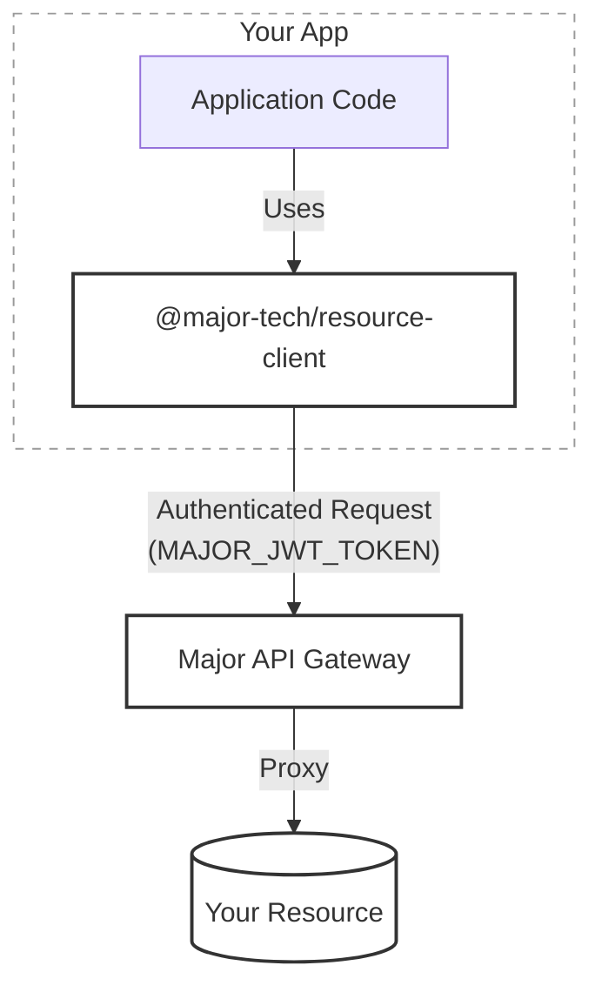

Connectors are the databases, APIs, and storage services your apps connect to. Major manages credentials securely so you never need to handle secrets in your code.

## How connectors work

- **Secure Flow**: Your app connects to the Major API, which proxies requests to your actual connectors.
- **Authentication**: Powered by a `MAJOR_JWT_TOKEN` issued to your session. This token contains your user scopes, ensuring the client can only access what you're permitted to access.
- **Generated Clients**: Major generates resource clients for you. You'll find one per resource in `src/clients/`.

## Setting up a connector

1. Navigate to **Organization Settings > Connectors**
2. Click **Add Connector** and select the type
3. Configure the connection details and credentials
4. Attach the connector to your app via the web editor or `major resource manage`

<Note>
Resource credentials are encrypted and never exposed to the client-side application code.
</Note>

## Per-environment configuration

When editing a connector, you can configure each environment independently. This lets you use different credentials or endpoints for staging and production.

| Environment | Host | Database |
| --- | --- | --- |
| default | prod.example.com | myapp_prod |
| staging | staging.example.com | myapp_staging |

You can also enable **shared configuration** for a resource, which uses a single configuration from the default environment across all environments instead of per-environment configs. When enabled, non-default environment tabs are locked with an explanatory tooltip.

<Card title="Learn more about Environments" icon="layer-group" href="/web/environments">
  See how to create and manage environments for your organization.
</Card>

## Resource context

You can upload context files — database schemas, OpenAPI specs, API documentation, and more — to any connector. The AI assistant uses this context when writing queries and API calls against that resource, so it understands your data model without you having to explain it every time. If your app needs a connector that hasn't been set up yet, the AI will show a setup card in the chat — click it to configure the resource inline without leaving the editor.

## Identity-based authentication

For AWS services (S3 and DynamoDB), you can use IAM Assume Role Identities instead of access keys. Create an identity in **Settings > Identities**, review the generated trust policy for your IAM role, and select identity-based authentication when configuring the resource.

For GCP services (BigQuery), you can authenticate via a service account JSON key in addition to OAuth. Create a GCP identity in **Settings > Identities** to manage service accounts across resources.

Identity-based authentication is more secure and avoids storing long-lived credentials.

## Rate limiting

Set hourly and daily invocation limits on any connector to protect downstream services from runaway usage. When a limit is reached, requests return `429 Too Many Requests` until the window resets. Configure limits when creating or editing a connector.

## Available connectors

<CardGroup cols={3}>
  <Card title="PostgreSQL" icon="database" href="/connectors/postgres">
    SQL database queries
  </Card>
  <Card title="DynamoDB" icon="table" href="/connectors/dynamodb">
    AWS NoSQL database
  </Card>
  <Card title="S3 Storage" icon="hard-drive" href="/connectors/s3">
    Object storage and files
  </Card>
  <Card title="AWS SQS" icon="message-square" href="/connectors/sqs">
    Message queue operations
  </Card>
  <Card title="Snowflake" icon="snowflake" href="/connectors/snowflake">
    Data warehouse queries
  </Card>
  <Card title="Microsoft SQL Server" icon="database" href="/connectors/mssql">
    SQL Server queries
  </Card>
  <Card title="MySQL" icon="database" href="/connectors/mysql">
    MySQL database queries
  </Card>
  <Card title="BigQuery" icon="database" href="/connectors/bigquery">
    Google BigQuery datasets
  </Card>
  <Card title="Neo4j" icon="circle-nodes" href="/connectors/neo4j">
    Graph database queries
  </Card>
  <Card title="AWS Lambda" icon="bolt" href="/connectors/lambda">
    Serverless function invocation
  </Card>
  <Card title="Custom API" icon="globe" href="/connectors/custom-api">
    Any REST API
  </Card>
  <Card title="GraphQL" icon="code" href="/connectors/graphql">
    Query any GraphQL endpoint
  </Card>
  <Card title="Salesforce" icon="cloud" href="/connectors/salesforce">
    CRM data and SOQL
  </Card>
  <Card title="HubSpot" icon="hubspot" href="/connectors/hubspot">
    CRM integration
  </Card>
  <Card title="Attio" icon="address-book" href="/connectors/attio">
    CRM records and objects
  </Card>
  <Card title="Outreach" icon="bullhorn" href="/connectors/outreach">
    Sales engagement
  </Card>
  <Card title="Stripe" icon="credit-card" href="/connectors/stripe">
    Payments and subscriptions
  </Card>
  <Card title="Plaid" icon="building-columns" href="/connectors/plaid">
    Bank account data and transactions
  </Card>
  <Card title="Clerk" icon="key" href="/connectors/clerk">
    User and org management
  </Card>
  <Card title="Google Sheets" icon="table-cells" href="/connectors/google-sheets">
    Spreadsheet access
  </Card>
  <Card title="Google Calendar" icon="calendar" href="/connectors/google-calendar">
    Calendar events and scheduling
  </Card>
  <Card title="Google Analytics" icon="chart-line" href="/connectors/google-analytics">
    GA4 reporting
  </Card>
  <Card title="Google Search Console" icon="search" href="/connectors/googlesearchconsole">
    Search analytics and sitemaps
  </Card>
  <Card title="Gmail" icon="envelope" href="/connectors/gmail">
    Read, search, and send email
  </Card>
  <Card title="Slack" icon="hashtag" href="/connectors/slack">
    Workspace messaging
  </Card>
  <Card title="RingCentral" icon="phone" href="/connectors/ringcentral">
    Communications data and APIs
  </Card>
  <Card title="Microsoft Teams" icon="comment-dots" href="/connectors/microsoft-teams">
    Teams, channels, and messaging
  </Card>
  <Card title="Notion" icon="file-text" href="/connectors/notion">
    Workspaces, pages, and databases
  </Card>
  <Card title="Linear" icon="circle-dot" href="/connectors/linear">
    Issue tracking and project management
  </Card>
  <Card title="SharePoint" icon="folder" href="/connectors/sharepoint">
    Microsoft SharePoint and OneDrive
  </Card>
  <Card title="Fireflies" icon="microphone" href="/connectors/fireflies">
    Meeting transcription and summaries
  </Card>
  <Card title="Zendesk" icon="life-ring" href="/connectors/zendesk">
    Customer support tickets and data
  </Card>
  <Card title="LinkedIn Marketing" icon="linkedin" href="/connectors/linkedinads">
    LinkedIn Ads and campaign analytics
  </Card>
  <Card title="Meta Marketing" icon="facebook" href="/connectors/metamarketing">
    Facebook and Instagram Ads
  </Card>
  <Card title="TikTok Ads" icon="video" href="/connectors/tiktokads">
    TikTok advertising campaigns
  </Card>
  <Card title="Gong" icon="phone" href="/connectors/gong">
    Revenue intelligence data
  </Card>
  <Card title="Microsoft Dynamics 365" icon="cloud" href="/connectors/dynamics-365">
    Dataverse CRM integration
  </Card>
</CardGroup>

## Pipedream Instance

Need an app that isn't listed above? Connect your own [Pipedream](/connectors/pipedream) account to reach thousands more integrations from Pipedream's catalog, with the third-party connections managed in your own Pipedream workspace.

<Card title="Pipedream Instance" icon="plug" href="/connectors/pipedream">
  Connect your own Pipedream account to reach the full app catalog.
</Card>

Don't see the connector you need? Click **Request it** in the Add Connector dialog to submit a request.
