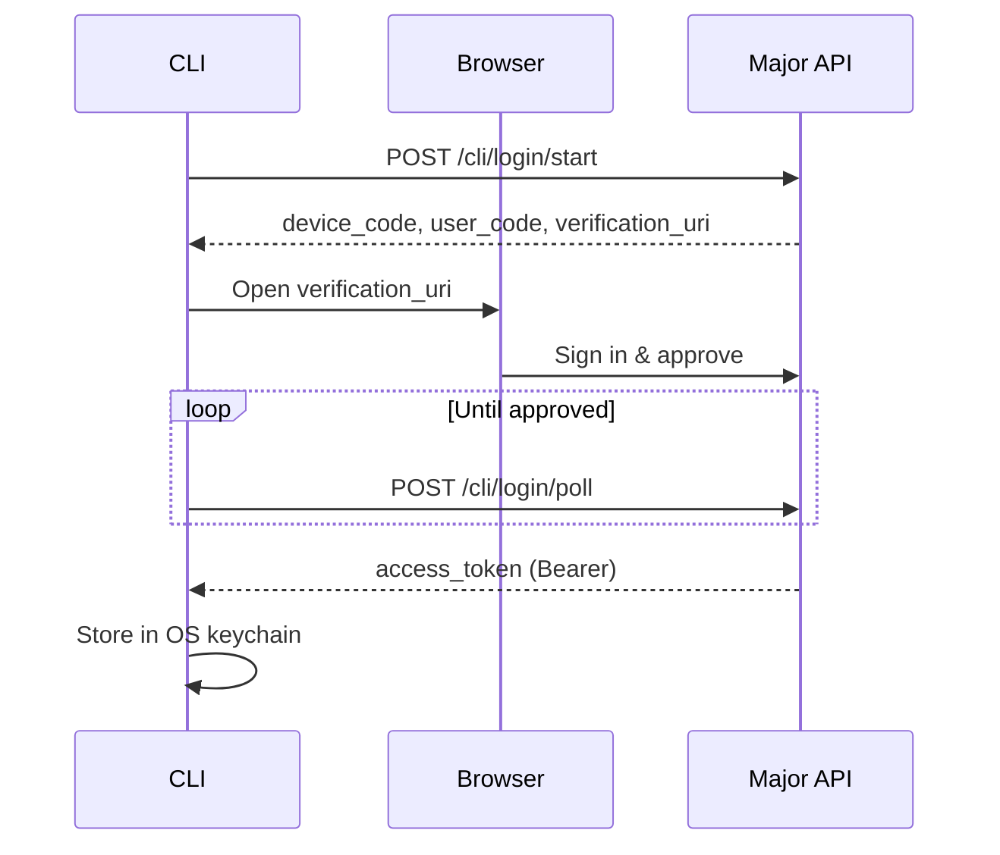
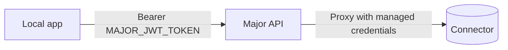

Major authenticates every request that touches your apps, connectors, and organization data. This page covers the sign-in methods Major supports and the tokens they produce.

## Identity providers

The web app at [app.major.build](https://app.major.build) supports three sign-in methods:

| Method | When to use |
| --- | --- |
| **Email + password** | Default for individual sign-ups. New accounts must verify their email before signing in. |
| **Google** | One-click sign-in for organizations on Google Workspace. Existing email accounts can be linked. |
| **SAML SSO** | Enterprise SSO for organizations with a verified domain. |

### SSO and domain verification

Admins can configure a SAML identity provider for their organization and verify ownership of an email domain. Once a domain is verified, users signing up with that domain are provisioned automatically and routed through SSO.

<Note>
SSO does not auto-create organizations. A Major admin still controls which org a new SSO user joins.
</Note>

### Invitations

Admins invite teammates from **Settings > Members**. Invitations are sent by email, expire after one week, and can be issued in batches. New users who accept an invite are added to the organization with the role specified at invite time. See [Permissions](/web/permissions) for role definitions.

## CLI authentication

The CLI uses the OAuth 2.0 Device Authorization Grant. Running `major user login` does the following:

1. Requests a one-time `user_code` from the Major API.
2. Opens your browser to a verification page pre-filled with the code.
3. You sign in to the web app (or are already signed in) and approve the CLI.
4. The CLI receives an opaque access token and stores it in your OS keychain.

```bash
major user login
```



### Token storage and lifetime

- **Storage** — tokens live in the OS keychain (Keychain on macOS, Secret Service on Linux) under the service `major-cli`. Your default organization, GitHub username, and other CLI preferences are stored alongside.
- **Lifetime** — CLI tokens are valid for **90 days**. There is no refresh flow; re-run `major user login` when your token expires.
- **Revocation** — `major user logout` removes the token from your keychain and revokes it server-side.

### Sending the token

Every CLI request includes the token in a standard Bearer header:

```
Authorization: Bearer <token>
```

The API enforces this on every `/cli/*` route and additionally checks organization and application permissions per route. See the [`major user`](/cli/user) and [`major org`](/cli/org) commands for the user-facing surface.

## App runtime tokens (`MAJOR_JWT_TOKEN`)

When you run `major app start`, the CLI calls the API to provision a development environment. The API mints a short-lived signed JWT scoped to your user and the application, then writes it to your local `.env` as `MAJOR_JWT_TOKEN` along with `MAJOR_API_BASE_URL`, `MAJOR_AI_PROXY_URL`, and `APPLICATION_ID`.

This is the token the generated resource clients in `src/clients/` use when proxying requests to your connectors:



Because the JWT carries your user identity, every connector call is checked against your resource permissions — the same checks that apply in deployed apps.

<Tip>
You never need to read or rotate `MAJOR_JWT_TOKEN` yourself. `major app start` refreshes it on each run.
</Tip>

## API tokens

Organizations can mint long-lived API tokens for service accounts and external integrations. These tokens:

- Are scoped to a single organization (no user identity attached).
- Carry the `MJR_` prefix so they're easy to spot in logs.
- Have a configurable expiration, set when the token is created.
- Authenticate the same way as CLI tokens — `Authorization: Bearer <token>`.

Manage API tokens from your organization settings. Treat them like any other credential: store them in a secret manager, rotate them on a schedule, and revoke them as soon as they're no longer needed.

## MCP authentication

Major exposes a hosted MCP server so AI tools (Claude, Cursor, Claude Code, etc.) can call into your apps and connectors. The server uses standard OAuth 2.0 with dynamic client registration:

1. The MCP client registers itself with Major's authorization server.
2. The user is sent through the standard authorization-code flow, signs in, and picks an organization on the consent screen.
3. The server issues a Bearer access token scoped to that organization.

Issued tokens use the scopes `mcp:connect` and `offline_access` and carry an `org_id` claim that pins them to the org the user selected. Send them in the standard header:

```
Authorization: Bearer <token>
```

The local CLI-based MCP server (used by Claude Code and Cursor for context-aware CLI help) does **not** require a separate token — it piggybacks on your existing `major user login` session.

See [`major org`](/cli/org#organization-resources-via-mcp) for org-scoped MCP capabilities and tools.

## Per-user OAuth for connectors

Some connectors (e.g. Google Calendar) support **per-user OAuth**, where each end-user authorizes their own account instead of sharing a single set of credentials. When a resource is configured for per-user OAuth:

- Unauthenticated users are redirected to a `/connect` page on first use.
- Once they authorize, the credential is stored against their Major user.
- Users manage and disconnect their authorized accounts from the **Connected Accounts** page in their account settings.

If a per-user OAuth credential is missing or has been revoked when an app tries to invoke the resource, Major returns an error and prompts the user to reconnect. See [Permissions › Per-User OAuth](/web/permissions#per-user-oauth) for the full configuration.

## Choosing the right credential

| You are… | Use |
| --- | --- |
| A developer signing in to the web app or CLI | Email/password, Google, or SSO via `major user login` |
| Running an app locally with `major app start` | `MAJOR_JWT_TOKEN` (managed automatically) |
| Connecting an AI tool via the hosted MCP server | OAuth flow with `mcp:connect` scope |
| Calling Major from a script, CI job, or third-party system | Organization API token (`MJR_…`) |
| End-user of a deployed app that needs their own Google/Salesforce/etc. account | Per-user OAuth via the Connected Accounts page |

## Next steps

<CardGroup cols={2}>
  <Card title="Permissions" icon="users" href="/web/permissions">
    See the roles and groups model that Major checks once you're authenticated.
  </Card>
  <Card title="major user" icon="terminal" href="/cli/user">
    Reference for `login`, `logout`, `whoami`, and related commands.
  </Card>
</CardGroup>
