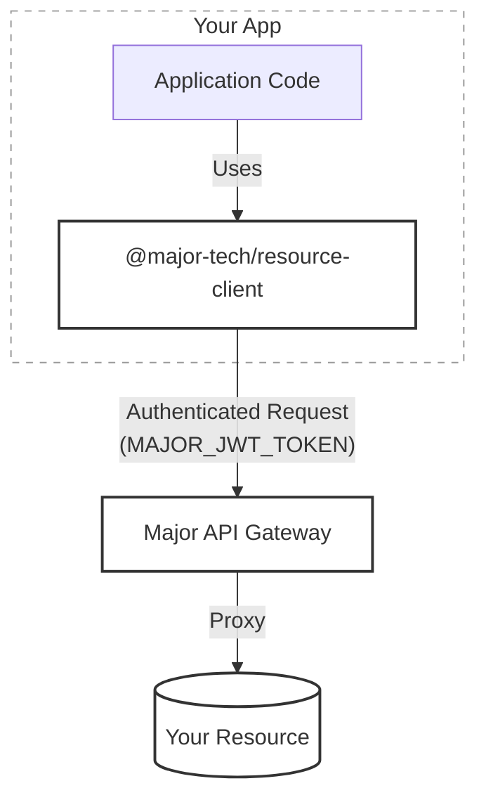

Major is built around three core concepts that work together to help you build, deploy, and secure internal tools.

# Apps

An **App** is a self-contained project that you build and deploy through Major

### Lifecycle

Apps follow a simple lifecycle:

1. **Create** — Scaffold from a template or clone an existing app
2. **Develop** — Build locally with the CLI or in the web editor
3. **Connect** — Attach connectors (databases, APIs)
4. **Deploy** — Ship to production with one command or click
5. **Share** — Grant access to teammates via RBAC

### Source Control

Every app is backed by a Git repository. Major hosts repositories by default, but you can connect your own GitHub organization at any time. Either way, the code is yours — clone, branch, and manage it with any Git tooling.

# Connectors

**Connectors** are the databases, APIs, and storage services your apps connect to. Major manages credentials securely so you never need to handle secrets in your code.

### Architecture



- **Secure Flow**: Your app connects to the Major API, which proxies requests to your actual connectors.
- **Authentication**: Powered by a `MAJOR_JWT_TOKEN` issued to your session. This token contains your user scopes, ensuring the client can only access what you're permitted to access.
- **Generated Clients**: Major generates resource clients for you. You'll find one per resource in `src/clients/`.

### Supported resource types

<CardGroup cols={3}>
  <Card title="PostgreSQL" icon="database">
    SQL database queries
  </Card>
  <Card title="DynamoDB" icon="table">
    AWS NoSQL database
  </Card>
  <Card title="S3 Storage" icon="hard-drive">
    Object storage and files
  </Card>
  <Card title="Custom API" icon="globe">
    Any REST API
  </Card>
  <Card title="HubSpot" icon="hubspot">
    CRM integration
  </Card>
  <Card title="Google Sheets" icon="table-cells">
    Spreadsheet access
  </Card>
</CardGroup>

### Using connectors in code

```typescript
import { myDatabaseClient } from './clients';

const result = await myDatabaseClient.invoke(
  'SELECT * FROM users WHERE active = true',
  [],
  'fetch-active-users'
);

if (result.ok) {
  console.log(result.result.rows);
}
```

<Tip>
Credentials flow through the Major platform. Your app never sees connection strings or API keys.
</Tip>

## RBAC (Role-Based Access Control)

Major provides granular access control at both the organization and application level.

### Organization roles

| Role | Permissions |
| --- | --- |
| **Member** | View apps and connectors |
| **Builder** | Create new apps |
| **Admin** | Full control including user management |

### Application roles

| Role | Permissions |
| --- | --- |
| **User** | View and run the deployed app |
| **Editor** | Modify code and create versions |
| **Admin** | Full control including sharing and deletion |

### Resource roles

| Role | Permissions |
| --- | --- |
| **User** | Use the resource in applications |
| **Admin** | Configure and manage the resource |

### Groups

Groups let you manage permissions for sets of users efficiently:

- **Inheritance** — Group members inherit all permissions granted to the group
- **Default permissions** — Configure groups to have automatic access to new apps
- **All Users group** — Every organization member, useful for open-by-default apps

## How they work together

1. **Admins** configure connectors and grant permissions to users and groups
2. **Builders** create applications and use connectors to securely access company data
3. **Users** get access to apps via RBAC and use them to get work done

## Next steps

<CardGroup cols={2}>
  <Card title="Get Started" icon="play" href="/getting-started/quickstart-cli">
    Build your first app with the CLI.
  </Card>
  <Card title="Resource Client" icon="code" href="/resource-client/index">
    Learn how to use generated clients in your code.
  </Card>
</CardGroup>
