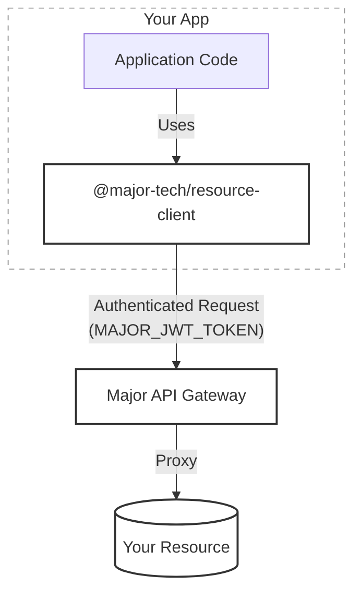

**Connectors** are the databases, APIs, and storage services your apps connect to. Major manages credentials securely so you never need to handle secrets in your code.

## Architecture

- **Secure Flow**: Your app connects to the Major API, which proxies requests to your actual connectors.
- **Authentication**: Powered by a `MAJOR_JWT_TOKEN` issued to your session. This token contains your user scopes, ensuring the client can only access what you're permitted to access.
- **Generated Clients**: Major generates resource clients for you. You'll find one per resource in `src/clients/`.

<Tip>
Credentials flow through the Major platform. Your app never sees connection strings or API keys.
</Tip>

<Card title="Browse all connectors" icon="server" href="/connectors">
  See setup guides and client documentation for all supported connectors.
</Card>
