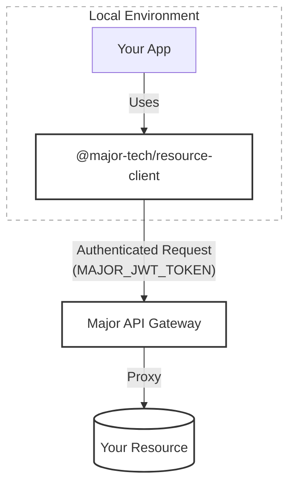

## Architecture

- **Secure Flow**: Your local environment connects to the Major API, which then proxies requests to your actual resources.
- **Authentication**: This process is powered by a `MAJOR_JWT_TOKEN` issued to your session. This token contains your user scopes, ensuring the client can only access what you as a user are permitted to access.
- **Generated Clients**: We generate resource clients for you. You'll find one per resource you connect to the app in `/src/clients`. 

## Workflow Tips

- Run `major resource create` to open the UI to create new resources.
- Run `major resource manage` to select which resources to connect to the app.
- `major app start` will regenerate your env token for you.

